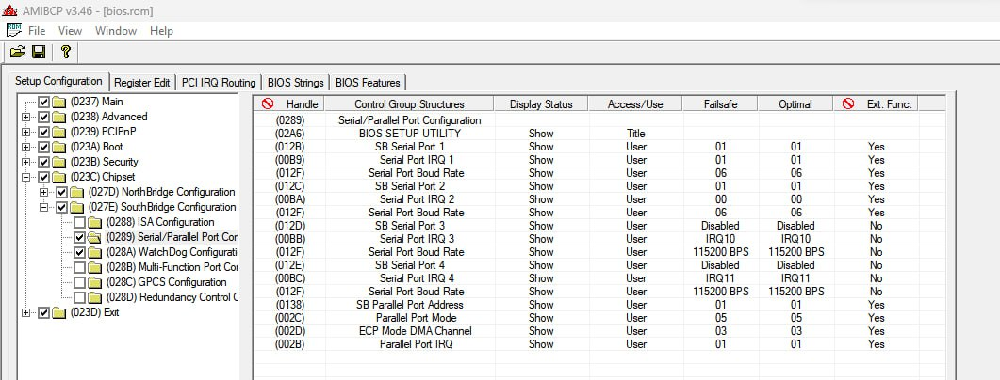

# Backup y modificaciones a la BIOS de la Vortex

**Advertencia! Mucho cuidado, la BIOS está guardada dentro del mismo chip de la CPU, no es posible desoldarla y cambiarla si uno comete errores**

Hay un mecanismo para actualizarla por JTAG incluso si se brickea pero no es algo trivial. Mucha precaución a la hora de actualizarla y moddearla.

- ANYBIOS.EXE: Programa para backupear la BIOS (pedir por privado)
- AMIBCP3.46.EXE: Programa para modificar la BIOS (pedir por privado)
- SPIFLASH.EXE: Programa para flashear la BIOS (pedir por privado)

Solo se validaron que funcionaran modificaciones leves:
- Modificar el nombre de la máquina en la BIOS
- Activar algunas opciones de los menúes de la BIOS, en particular los puertos COM

Ejemplo de habilitación de menú para tener puertos COM, originalmente el checkbox `Serial/Parallel Port Configuration` de la izquierda estaba desactivado:
