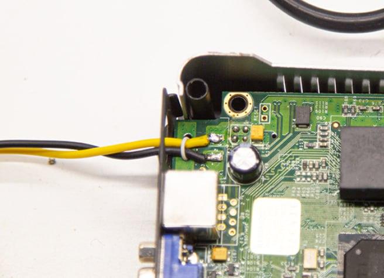

# Bypass del cable de alimentación

- Desoldar el conector existente. Para esto se puede calentar un pin, hacer palanca y cortarlo con un alicate
- Remover los restos del pin existente
- Soldar dos cables a los pads correctos (en la placa aparecen como GND y 5V)
- Usar otro alambre o cable pasado por el agujero como _strain relief_ (para evitar que se rompan los mismos al tironear)

