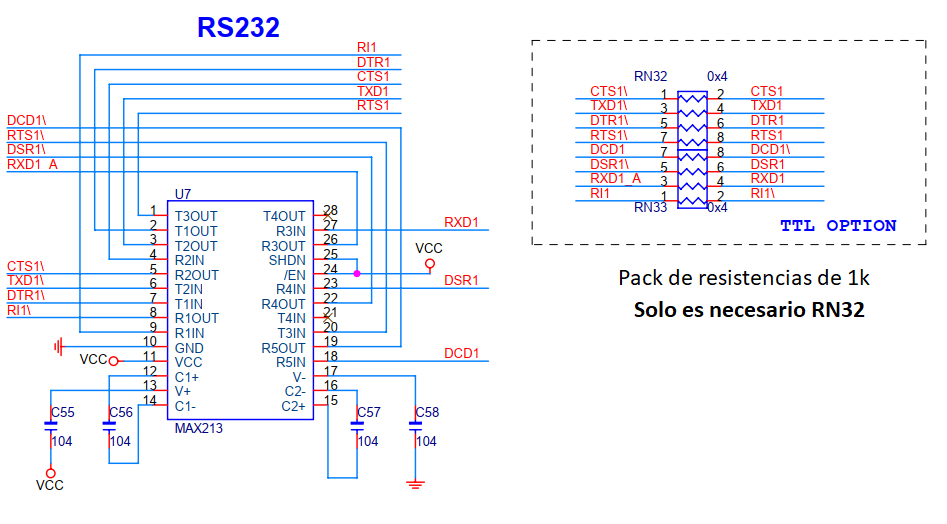
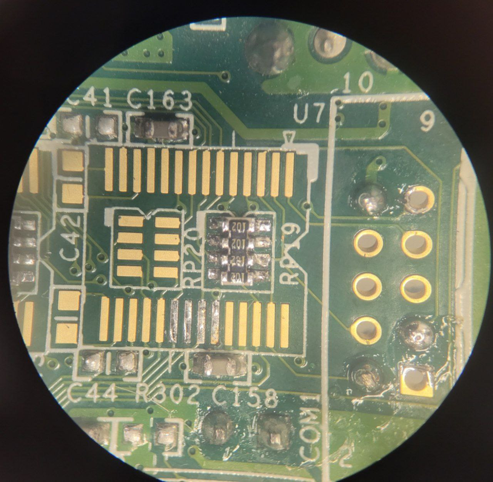
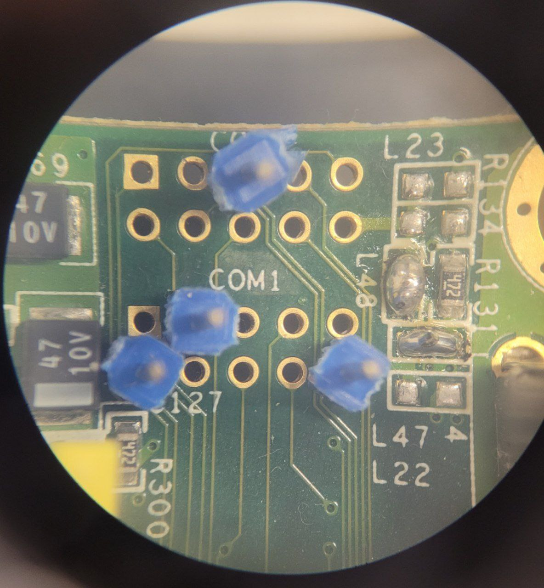

# Agregar puerto serie RS232 o UART

Las placas que tenemos tienen cableados los puertos COM1 y COM2, pero no suelen venir con todos los componentes necesarios para usarlas. Existen dos posibilidades para agregarlos:

- Modo RS232: ideal para conectar la Vortex a una Palm, mouse y otros dispositivos que usen el puerto serie con el típico conector DE9
- Modo TTL/UART: ideal para conectarla a la uart de un microcontrolador, o cualquier módulo que trabaje con pines de TX y RX de baja tensión (0-5V)

Ambas opciones se observan en la siguiente imagen extraida del esquemático de ejemplo:

- Para usar RS232 será necesario soldar un MAX213 por cada puerto COM, y sus 4 capacitores de 100 nF (sin polaridad)
- Para usar TTL/UART solo es necesario soldar un pack de resistencias por puerto, como se observa en la siguiente foto:

Es necesario recordar que los conectores expuestos no poseen la separación típica de 2.54mm sino que son de 2mm. Esto trae problemas a la hora de usar las típicas tiras de pines por lo que recomiendo usar pines individuales, como se observa aquí:

El pin 10 puede terminar conectado a 5v o 3.3v dependiendo de cuales jumpers se suelden. En la serigrafía aparecen como "L" ya que originalmente se suponía que fueran incutores. Si se suelda como en la foto de arriba, los mismos estarán configurados para 3.3V.

En el caso de que no aparezcan los puertos COM1/2 en la BIOS, es probable que el MSDOS y otros sistemas operativos no lo reconozcan. En este caso hay que modificar la BIOS para que soporte configurarlos desde su menú, y luego habilitarlos. [Ver más información sobre esa modificación](mod_bios.md)